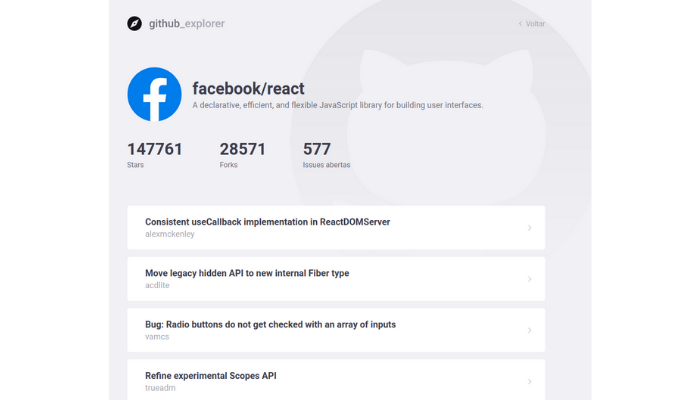

# Explorer repositories

> Projeto desenvolvido no bootcamp **GoStack** ministrada pela **Rocketseat**.


<a href="https://www.linkedin.com/in/rodrigo-yoshioka" target="_blank" >

</a>
<a href="mailto:rodrigo.yoshioka@gmail.com" target="_blank" >

</a>

## Sobre o projeto

O projeto é uma alternativa para explorar repositórios na plataforma GitHub. Podemos selecionar os repositórios, que irão ficar salvos temporariamente, e podemos consultar quantas _stars_, _forks_ e _issues_. Logo abaixo as _issues_ serão listadas.




## Tecnologias utilizadas

Este projeto foi desenvolvido com as seguintes tecnologias:

- [React](https://www.npmjs.com/package/react)
- [Eslint](https://www.npmjs.com/package/eslint)
- [Prettier](https://www.npmjs.com/package/prettier)

## Instalação

```sh
yarn install
```

## Utilização
 ```sh
yarn start
```
